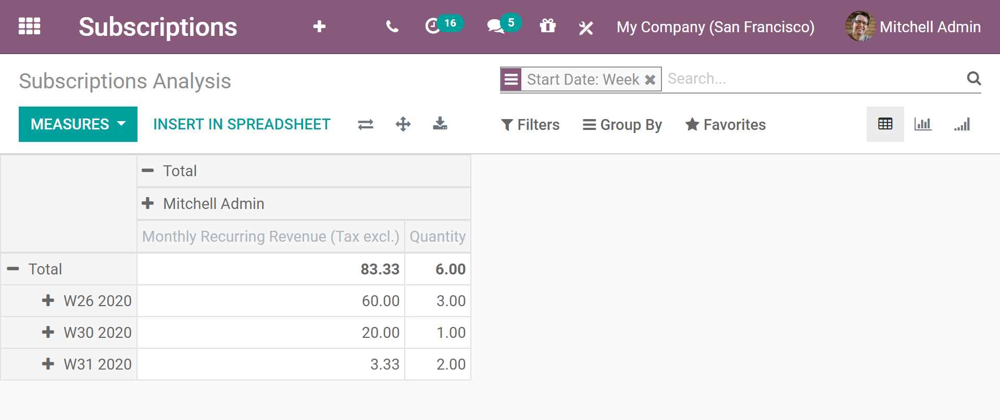
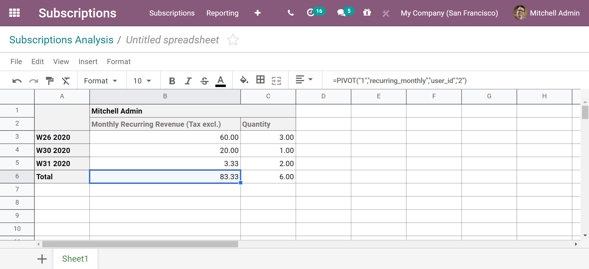
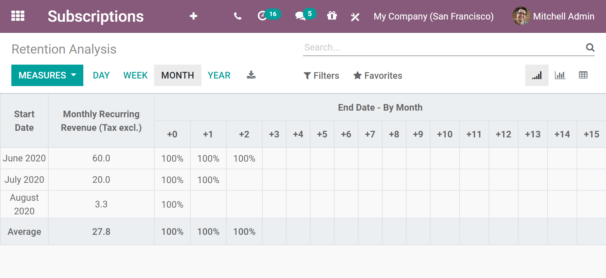
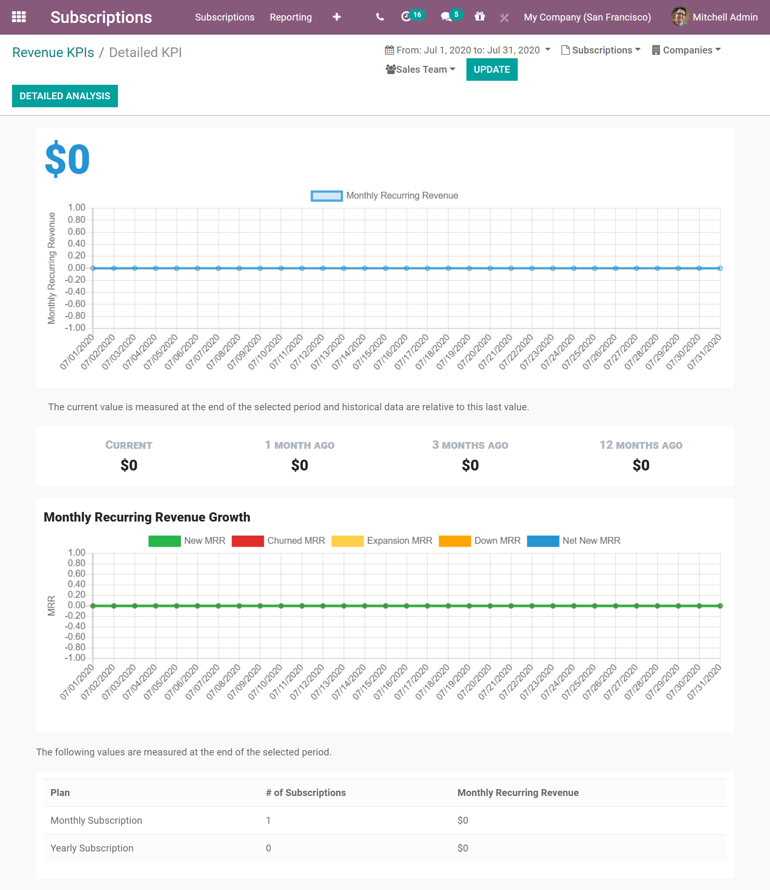
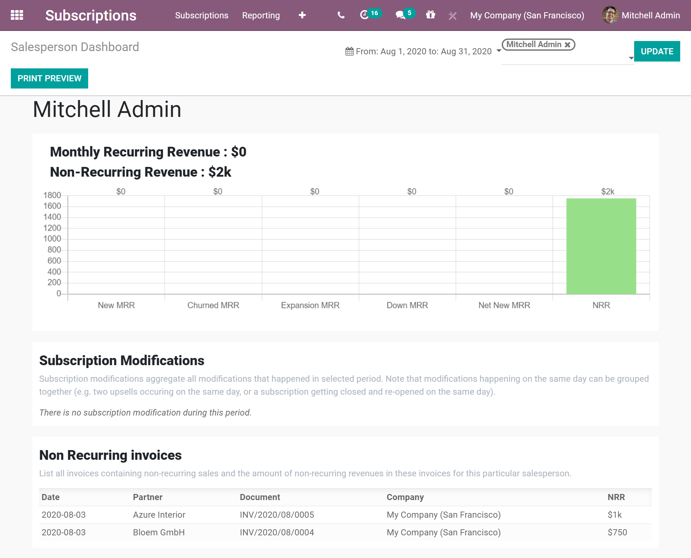

=================================
Discover our subscription reports
=================================

As we now know well enough, understanding how our business is going and where it is going is the key
to success. This is even more the case when we offer subscription services or products.

Before getting to the heart of the matter, it is very important to recall certain concepts essential
to the proper understanding of the following reports:

- **Monthly Recurring Revenue (MRR)**: MRR is arguably the most important metric for subscription
  businesses. Indeed, it shows the revenue earned with subscription-based products or services every
  single month. It is a consistent number that you can use to track all your recurring revenue over
  time, in monthly increments.

- **Annual Run-Rate (ARR)**: ARR is the yearly version of MRR. Based on the current MRR, you can
  estimate the coming year's performance with the Annual Run-Rate. However, this estimation does not
  take variations and growth into account.

.. image:: media/difference-between-MRR-and-ARR.png
  :align: center
  :alt: Difference between MRR and ARR in Odoo Subscriptions

- **Non-Recurring Revenue (NRR)**: NRR shows the revenue earned for everything else than
  subscription-based products or services. This includes gains of a rare or unique nature that are
  unlikely to occur in the ordinary course of businesses.

- **Customer Retention**: This concept consists of engaging existing customers to continue buying
  products or services from your business. As you may know, customer retention is quite a challenge
  because you must prove yourselves worthy of your customers' trust.

- **Churn Rate**: Also known as the rate of attrition or customer churn, the churn rate can be
  defined, in this case, as the percentage of service subscribers who discontinue their subscriptions
  within a given time period. We can distinguish two types of Churn:

  - **Logo Churn**: It corresponds to the subscription cancellation rate.

  - **Revenue Churn**: It corresponds to the monthly recurring revenue loss rate.

  .. note::
     Let's imagine an increase of 2$ on a service subscription.

     - We loss three customers out of the initial 20 which gives us a **Logo Churn** of 15%.
     - | Therefore, the 56$ of MRR difference out of the initial 600$ gives us a **Revenue Churn**
       | of 9,33%.

     .. image:: media/difference-between-logo-churn-and-revenue-churn.png
        :align: center
        :alt: Difference between logo churn and revenue churn in Odoo Subscriptions

     As a reminder, though they seem to evolve in the same direction most of the time, it might not
     be the case all time.

- **Customer Lifetime Value (CLV)**: Very important measure which indicates how much revenue can be
  expected for a customer during his/her entire contract. This approach emphasizes the importance of
  customer retention, shifting our focus from a quarterly or yearly approach to a long-term vision.

Check out the different kinds of reports you can access from the **Odoo Subscriptions** application.

Subscriptions analysis report
=============================

Go to :menuselection:`Subscriptions --> Reporting --> Subscriptions`. From there, you can change the
*Measures*. By default, Odoo uses the *Monthly Recurring Revenue*. In addition to that, you can
choose *Quantity*, *Recurring Price*, *Untaxed Recurring Price*, *Yearly Recurring Revenue* and
*Count*. For this example, *Quantity* is added. This way, you can review both of these measures at
the same time. You can even *Group By Start Date* and more precisely, by *Week* to get a clear view
of your report.

To ease the analysis of your data, you can click on the *Insert In Spreadsheet* button. The interface
of the Odoo spreadsheet feature has been improved in our most elaborated version of Odoo. Everything
has been done to facilitate the user experience.

Retention analysis report
=========================

Go to :menuselection:`Subscriptions --> Reporting --> Retention`. As previously explained, you can
change the *Measures* you want to apply in your analysis. In this case, Odoo uses *Count* by default.
For this example, *Monthly Recurring Revenue* is chosen and the *Month* periodicity remains intact.
By using these criteria, you can see the progression of the retention based on when it started.

Revenue KPIs report
===================

Go to :menuselection:`Subscriptions --> Reporting --> Revenue KPIs`. From this page, you have a lot
of information. Effectively, you have your different KPIs: *Monthly Recurring Revenue*, *Annual Run-Rate*,
*Revenue Churn*, *Logo Churn*, and more. You can also filter this information on subscriptions,
companies, and on sales teams. This is really useful if you are looking for some specific information.

For this example, the *Monthly Recurring Revenue* is chosen. At the moment, there is no data. This is
typically the case when you are just starting your business. But, as your company grows over the months,
these graphs will be populated with more and more data. Once again, you can filter these specific KPIs
on subscriptions, companies, and sales teams.

Salesperson dashboard report
============================

Go to :menuselection:`Subscriptions --> Reporting --> Salesperson Dashboard`. This page gives you a
summary of your *Monthly Recurring Revenue*, your *Non-Recurring Revenue*, your
*Subscription modifications*, and your *Non-Recurring Invoices* for each of your salespeople. You
can choose the period you want to apply and the salesperson you want to analyze.

.. seealso::
  - :doc:`../../subscriptions/configuration/subscription_templates`
  - :doc:`../../subscriptions/configuration/subscription_products`
  - :doc:`../../subscriptions/sales_flow/create_a_quotation`
  - :doc:`../../subscriptions/sales_flow/renewals`
  - :doc:`../../subscriptions/sales_flow/upselling`
  - :doc:`../../subscriptions/sales_flow/closing`